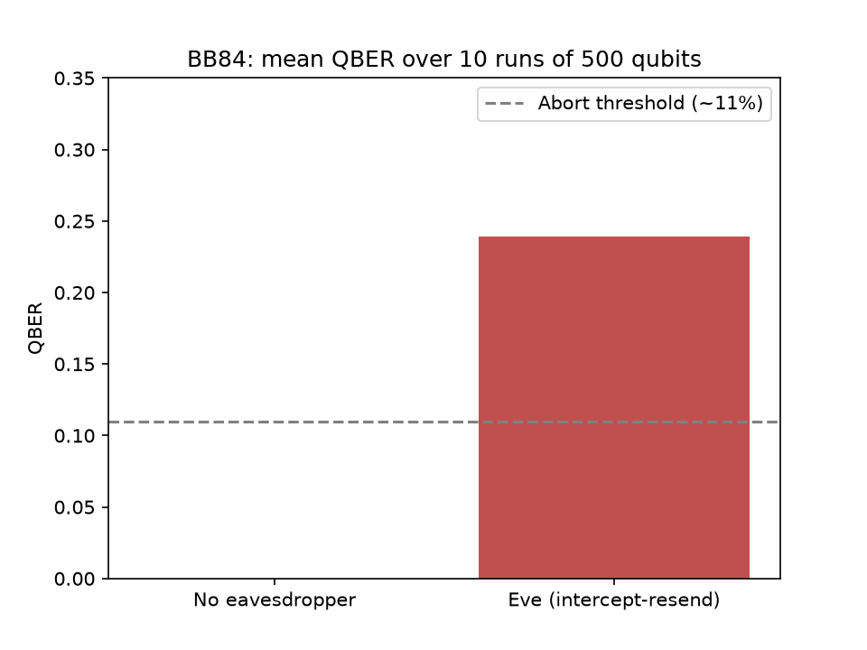

# bb84-sim

A Python simulator of the BB84 quantum key distribution protocol, built with Qiskit.



Without an eavesdropper, the sifted key has a QBER of **0%**. When Eve performs an
intercept-resend attack, the QBER rises to **~25%**, well above the ~11% abort
threshold. The eavesdropper is detected.

## How it works

1. **Alice** draws random bits and random bases (`Z` or `X`).
2. **Encoding:** each bit is prepared as |0⟩, |1⟩, |+⟩ or |−⟩ (`encode_qubit`).
3. **Bob** measures each qubit in a randomly chosen basis. Measuring in the `X`
   basis means applying H, then measuring in `Z` (`measure_qubit`).
4. **Sifting:** Alice and Bob keep only the positions where their bases match,
   about 50% of them (`sift`).
5. **QBER:** the fraction of positions where the two sifted keys differ (`qber`).

**Eve** (`eve_intercept`) measures each qubit in a random basis and re-sends a
qubit encoding her result. The no-cloning theorem gives her no better option. When
she picks the wrong basis (1/2 of the time), Bob then gets a wrong bit half of the
time: 1/2 × 1/2 = 25% errors on the sifted key.

## Install

```
git clone https://github.com/Athmane-quantum/bb84-sim.git
cd bb84-sim
python -m venv .venv
.venv\Scripts\activate        # Windows
pip install -e ".[dev]"
```

## Usage

```python
from bb84 import random_bits, random_bases, transmit, sift, qber

n = 1000
alice_bits = random_bits(n)
alice_bases = random_bases(n)
bob_bases = random_bases(n)

results = transmit(alice_bits, alice_bases, bob_bases, eve=True)
key_alice, key_bob = sift(alice_bits, alice_bases, bob_bases, results)
print(qber(key_alice, key_bob))   # ~0.25 with Eve, 0.0 without
```

Reproduce the figure: `python scripts/plot_qber.py`

## Tests

```
pytest
```

24 tests, including a perfect-channel proof (sifted keys are identical) and an
eavesdropper-detection test (QBER within 18–32%).

## Project structure

```
src/bb84/alice.py      random bits and bases, qubit encoding and measurement
src/bb84/protocol.py   transmission, sifting, QBER
src/bb84/eve.py        intercept-resend attack
tests/                 pytest suite
scripts/plot_qber.py   figure generation
```

## Limitations

- Ideal channel: no noise, no photon loss. Single-qubit state-vector simulation,
  not real hardware.
- Only the intercept-resend attack is modeled.
- No error correction or privacy amplification after sifting.

## Author

Athmane Mekhalfia, self-taught project.

## License

MIT, see [LICENSE](LICENSE).

## Citation

A DOI will be issued through Zenodo.